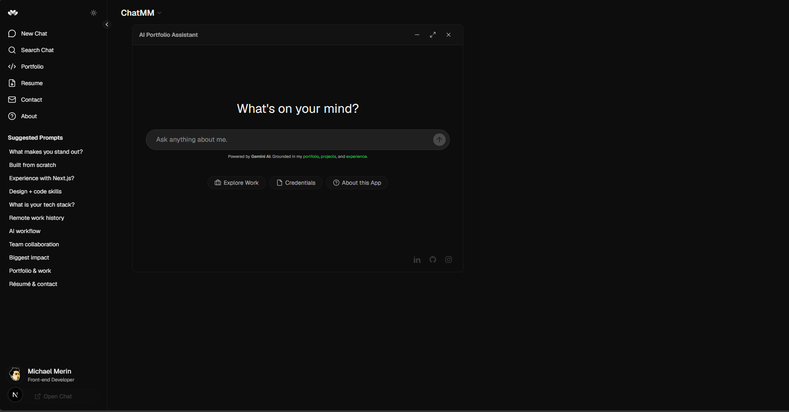

# 🤖 ChatMM – AI Portfolio Assistant

An AI-powered portfolio assistant that allows recruiters and visitors to explore my projects, skills, and experience through a conversational interface.

Built with **Next.js, React, TypeScript, Tailwind CSS, and Gemini API**, this project demonstrates modern frontend engineering and AI integration.

---

## ✨ Features

- 💬 Conversational AI portfolio experience
- ⚡ Real-time responses using Gemini API
- 🪟 Desktop-style draggable window UI
- 📱 Fully responsive design
- 🎨 Modern UI with Tailwind CSS + shadcn/ui
- 🔒 Secure API handling via Next.js API routes

---

## 🛠️ Tech Stack

- Next.js (App Router)
- React
- TypeScript
- Tailwind CSS
- Gemini API

---

## 🌐 Live Demo

👉 https://your-deployment-link.vercel.app

---

## 📸 Preview



---

## 🚀 Getting Started

```bash
npm install
npm run dev
```
---

## 👤 Author

**Maykel Mewin**  
Frontend Engineer  

- GitHub: https://github.com/maykelmewin

---

## 📌 Notes

- AI responses are powered by Gemini API
- No database required (frontend-focused project)
- Built as a portfolio showcase to demonstrate AI + UI engineering skills